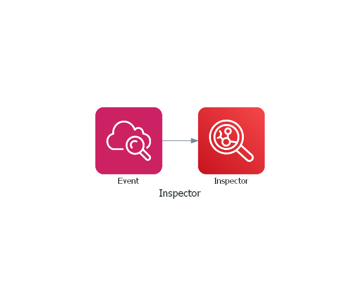

# terraform-aws-inspector

[](https://github.com/JamesWoolfenden/terraform-aws-inspector)
[](https://github.com/JamesWoolfenden/terraform-aws-inspector/releases/latest)
[](https://github.com/JamesWoolfenden/terraform-aws-apigateway/releases/latest)

[](https://www.bridgecrew.cloud/link/badge?vcs=github&fullRepo=JamesWoolfenden%2Fterraform-aws-apigateway&benchmark=CIS+AWS+V1.2)
[](https://github.com/pre-commit/pre-commit)
[](https://www.checkov.io/)
[](https://www.bridgecrew.cloud/link/badge?vcs=github&fullRepo=JamesWoolfenden%2Fterraform-aws-apigateway&benchmark=INFRASTRUCTURE+SECURITY)

---

Terraform module - see example for a basic implementation.
You'll need to know the rules packages, you want the example shows you how to set up a template that has all the basic rules.

---

It's 100% Open Source and licensed under the [APACHE2](LICENSE).


## Usage

For a basic illustration look at the example - **examplea**.

Include this repository as a module in your existing Terraform code as **module.inspector.tf**:

```terraform
module "inspector" {
  source        = "JamesWoolfenden/inspector/aws"
  version       = "v0.0.11"
  common_tags   = var.common_tags
  group_arn     = aws_inspector_resource_group.group.arn
  rule          = var.rule
  template_name = var.template_name
  target_name   = var.target_name
}
```

<!-- BEGINNING OF PRE-COMMIT-TERRAFORM DOCS HOOK -->

## Requirements

No requirements.

## Providers

| Name                                             | Version |
| ------------------------------------------------ | ------- |
| <a name="provider_aws"></a> [aws](#provider_aws) | n/a     |

## Modules

No modules.

## Resources

| Name                                                                                                                                                    | Type     |
| ------------------------------------------------------------------------------------------------------------------------------------------------------- | -------- |
| [aws_cloudwatch_event_rule.inspector](https://registry.terraform.io/providers/hashicorp/aws/latest/docs/resources/cloudwatch_event_rule)                | resource |
| [aws_cloudwatch_event_target.inspect](https://registry.terraform.io/providers/hashicorp/aws/latest/docs/resources/cloudwatch_event_target)              | resource |
| [aws_inspector_assessment_target.target](https://registry.terraform.io/providers/hashicorp/aws/latest/docs/resources/inspector_assessment_target)       | resource |
| [aws_inspector_assessment_template.template](https://registry.terraform.io/providers/hashicorp/aws/latest/docs/resources/inspector_assessment_template) | resource |

## Inputs

| Name                                                                        | Description                          | Type        | Default | Required |
| --------------------------------------------------------------------------- | ------------------------------------ | ----------- | ------- | :------: |
| <a name="input_duration"></a> [duration](#input_duration)                   | n/a                                  | `string`    | n/a     |   yes    |
| <a name="input_group_arn"></a> [group_arn](#input_group_arn)                | Contains a tagging map for instances | `string`    | `""`    |    no    |
| <a name="input_inspector_role"></a> [inspector_role](#input_inspector_role) | n/a                                  | `any`       | n/a     |   yes    |
| <a name="input_package_arns"></a> [package_arns](#input_package_arns)       | n/a                                  | `list(any)` | n/a     |   yes    |
| <a name="input_rule"></a> [rule](#input_rule)                               | Event rule details                   | `any`       | n/a     |   yes    |
| <a name="input_target_name"></a> [target_name](#input_target_name)          | Assessment target name               | `string`    | n/a     |   yes    |
| <a name="input_template_name"></a> [template_name](#input_template_name)    | Templates name                       | `string`    | n/a     |   yes    |

## Outputs

| Name                                                        | Description |
| ----------------------------------------------------------- | ----------- |
| <a name="output_rule"></a> [rule](#output_rule)             | n/a         |
| <a name="output_target"></a> [target](#output_target)       | n/a         |
| <a name="output_template"></a> [template](#output_template) | n/a         |

<!-- END OF PRE-COMMIT-TERRAFORM DOCS HOOK -->

## Related Projects

Check out these related projects.

- [terraform-aws-s3](https://github.com/jameswoolfenden/terraform-aws-s3) - S3 buckets

## Help

**Got a question?**

File a GitHub [issue](https://github.com/JamesWoolfenden/terraform-aws-inspector/issues).

## Contributing

### Bug Reports & Feature Requests

Please use the [issue tracker](https://github.com/JamesWoolfenden/terraform-aws-inspector/issues) to report any bugs or file feature requests.

## Copyrights

Copyright © 2019-2022 James Woolfenden

## License

[](https://opensource.org/licenses/Apache-2.0)

See [LICENSE](LICENSE) for full details.

Licensed to the Apache Software Foundation (ASF) under one
or more contributor license agreements. See the NOTICE file
distributed with this work for additional information
regarding copyright ownership. The ASF licenses this file
to you under the Apache License, Version 2.0 (the
"License"); you may not use this file except in compliance
with the License. You may obtain a copy of the License at

<https://www.apache.org/licenses/LICENSE-2.0>

Unless required by applicable law or agreed to in writing,
software distributed under the License is distributed on an
"AS IS" BASIS, WITHOUT WARRANTIES OR CONDITIONS OF ANY
KIND, either express or implied. See the License for the
specific language governing permissions and limitations
under the License.

### Contributors

[![James Woolfenden][jameswoolfenden_avatar]][jameswoolfenden_homepage]<br/>[James Woolfenden][jameswoolfenden_homepage]

[jameswoolfenden_homepage]: https://github.com/jameswoolfenden
[jameswoolfenden_avatar]: https://github.com/jameswoolfenden.png?size=150
[github]: https://github.com/jameswoolfenden
[linkedin]: https://www.linkedin.com/in/jameswoolfenden/
[twitter]: https://twitter.com/JimWoolfenden
[share_twitter]: https://twitter.com/intent/tweet/?text=terraform-aws-inspector&url=https://github.com/JamesWoolfenden/terraform-aws-inspector
[share_linkedin]: https://www.linkedin.com/shareArticle?mini=true&title=terraform-aws-inspector&url=https://github.com/JamesWoolfenden/terraform-aws-inspector
[share_reddit]: https://reddit.com/submit/?url=https://github.com/JamesWoolfenden/terraform-aws-inspector
[share_facebook]: https://facebook.com/sharer/sharer.php?u=https://github.com/JamesWoolfenden/terraform-aws-inspector
[share_email]: mailto:?subject=terraform-aws-inspector&body=https://github.com/JamesWoolfenden/terraform-aws-inspector

### Notes

For more details look athe AWS documentation here:
<https://docs.aws.amazon.com/inspector/latest/userguide/inspector_slr.html>

and here:
<https://docs.aws.amazon.com/cli/latest/reference/inspector/index.html>

Imports

```cli
terraform import module.inspector.aws_inspector_assessment_target.target arn:aws:inspector:eu-west-1:xxxxxxxxx:target/0-WXdEI6N4
terraform import module.inspector.aws_inspector_assessment_template.template arn:aws:inspector:eu-west-1:xxxxxxxxx:target/0-WXdEI6N4/template/0-HWzZC5g2

aws inspector describe-assessment-targets --assessment-target-arns arn:aws:inspector:eu-west-1:680235478471:target/0-WXdEI6N4
{
    "assessmentTargets": [
        {
            "arn": "arn:aws:inspector:eu-west-1:xxxxxxxxx:target/0-WXdEI6N4",
            "name": "Assessment-Target-All-Instances",
            "resourceGroupArn": "arn:aws:inspector:eu-west-1:xxxxxxxxx:resourcegroup/0-DIVXsGMP",
            "createdAt": 1579347554.241,
            "updatedAt": 1579348640.217
        }
    ],
    "failedItems": {}
}

aws inspector describe-assessment-templates --assessment-template-arns arn:aws:inspector:eu-west-1:xxxxxxxxx:target/0-WXdEI6N4/template/0-HWzZC5g2

terraform import module.inspector.aws_cloudwatch_event_rule.inspector Amazon_Inspector_Assessment_0-HWzZC5g2_Id3mgqa
terraform import  module.inspector.aws_cloudwatch_event_target.inspect Amazon_Inspector_Assessment_0-HWzZC5g2_Id3mgqa/0-WXdEI6N4/template/0-HWzZC5g2
```
